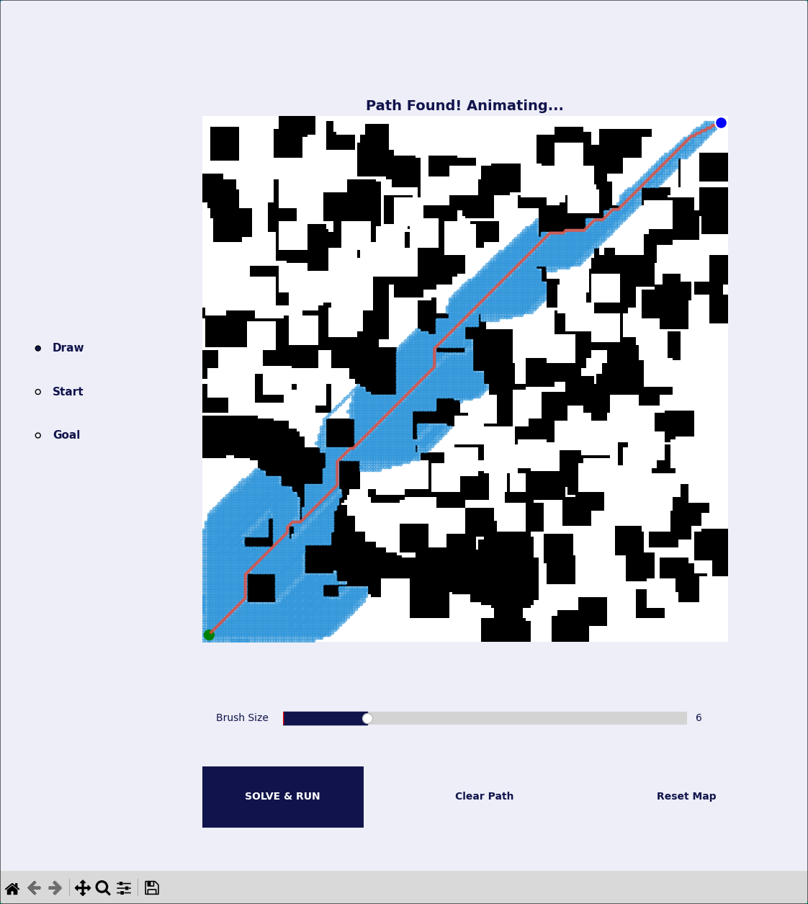

# A* Pathfinding Visualizer



This project is an interactive tool for visualizing the A* pathfinding algorithm in a 2D grid environment. Users can draw and erase obstacles, set the start and goal positions, and watch the algorithm find the optimal path in real-time.

## Features

- **Interactive Maze Creation:** Click and drag to draw or erase obstacle walls directly on the grid.
- **Customizable Start/Goal:** Easily move the start and goal markers to any valid position.
- **A* Algorithm Visualization:** Watch the A* algorithm explore the grid step-by-step, showing visited nodes.
- **Dual-Phase Animation:** The visualization first shows the exploration process and then animates a robot moving along the final, optimal path.
- **Adjustable Controls:** Use the slider to change the brush size for drawing obstacles. Robot and exploration speeds can be configured directly in the script.
- **Modern UI:** A clean, modern interface built with Matplotlib widgets, featuring a custom color palette and interactive, styled buttons.

## Project Structure

- `main.py`: The main script that runs the entire interactive application, including the GUI and event handling.
- `astar_logic.py`: Contains the core A* pathfinding algorithm logic.
- `requirements.txt`: A list of the required Python packages.
- `output/`: This directory is currently unused but can be utilized for saving outputs if needed in the future.

## Setup

1. **Clone the repository:**
   ```bash
   git clone <repository-url>
   cd <repository-directory>
   ```

2. **Create and activate a virtual environment:**
   - On Windows:
     ```bash
     python -m venv .venv
     .venv\Scripts\activate
     ```
   - On macOS and Linux:
     ```bash
     python -m venv .venv
     source .venv/bin/activate
     ```

3. **Install the required dependencies:**
   ```bash
   pip install -r requirements.txt
   ```

## How to Run

To launch the A* Pathfinding Visualizer, run the `main.py` script:

```bash
python main.py
```

A window will open displaying the grid.

## How to Use

1.  **Mode Selection:** Use the radio buttons on the left to switch between modes:
    -   **Draw:** Click and drag on the grid to draw walls (obstacles). Clicking on an existing wall will erase it. Use the "Brush Size" slider to change the thickness of your drawing tool.
    -   **Start:** Click anywhere on the grid to set the robot's starting position.
    -   **Goal:** Click anywhere on the grid to set the target goal position.

2.  **Controls:**
    -   **SOLVE & RUN:** Executes the A* algorithm to find the path and then animates the solution.
    -   **Clear Path:** Removes the visualized path and exploration steps from the grid.
    -   **Reset Map:** Clears all drawn obstacles, resetting the grid to its initial empty state.

## Dependencies

- `matplotlib`
- `numpy`